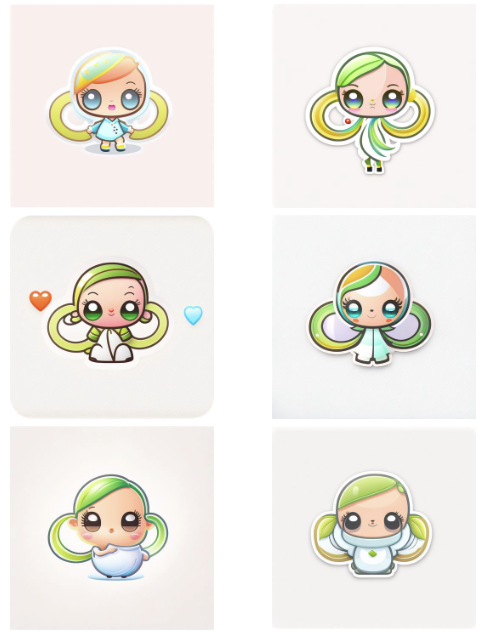

# tiny-enchanter-sample

- 팀 명: nini
- 서비스 이름: 꼬마 마법사 (tiny-enchanter)
- 이름의 의미: "Tiny Enchanter"는 '작은 마법사' 또는 '매혹적인 작은 것을 만드는 사람'이라는 의미를 가질 수 있습니다. 
             이는 SD 케릭터를 만드는 저희 서비스에 대한 독특하고 매력적인 이름입니다.
- 파이널 프로젝트 sample repository 입니다.
- Stable diffusion 모델을 이용한 서비스 입니다.

